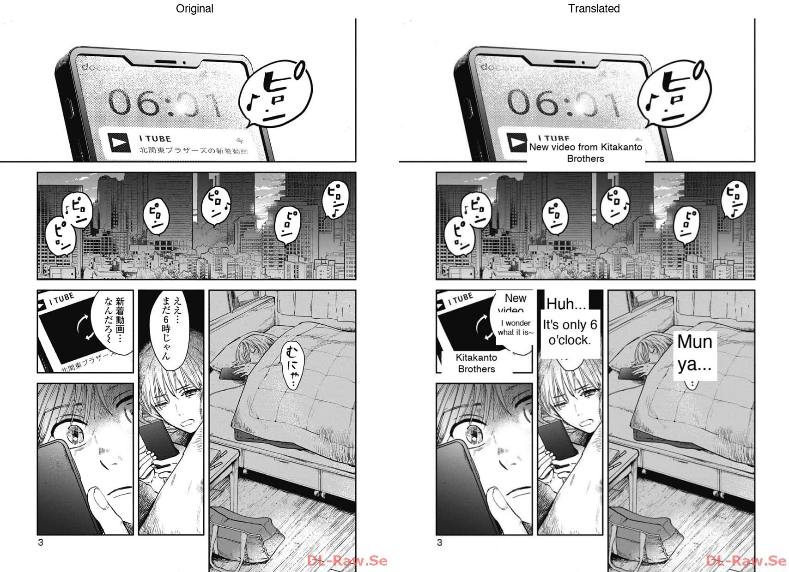
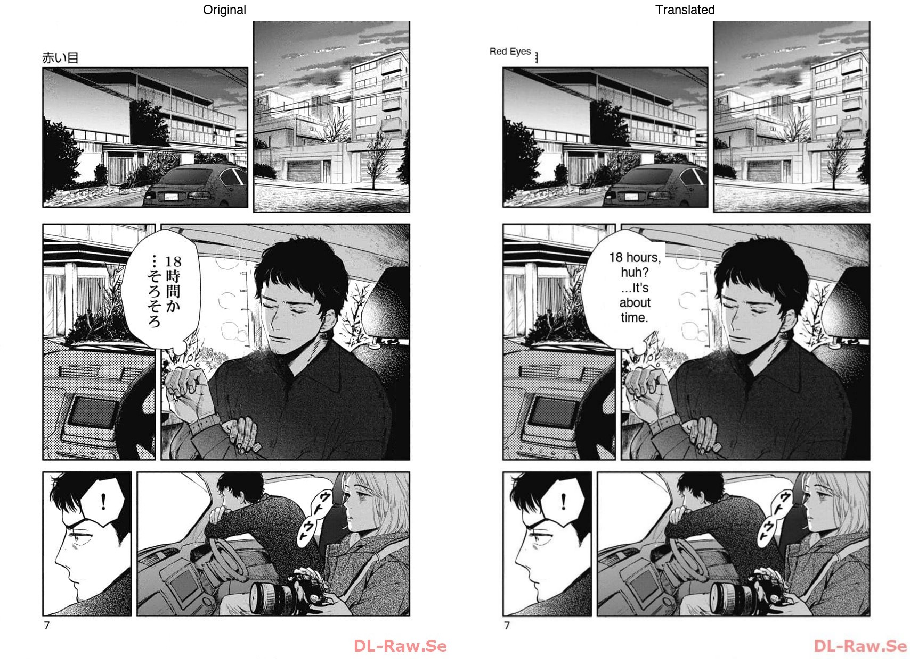
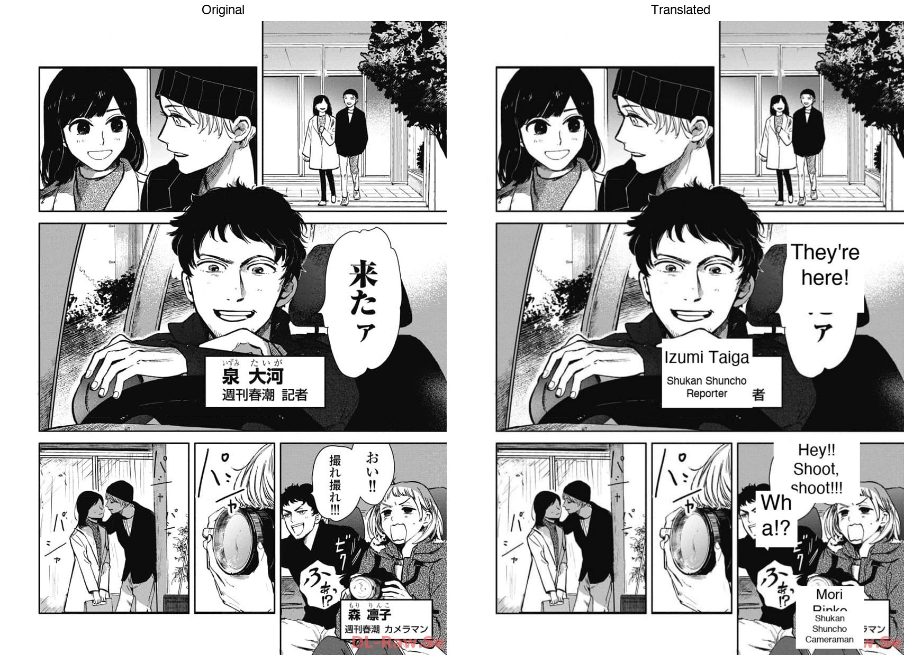

# manga-translator

Translate raw Japanese manga volumes to English using Google Gemini. Reads a folder of manga page images, extracts text from speech bubbles, narration boxes, and signs with bounding boxes, erases the original Japanese, renders English translations in place, and outputs a single PDF.

## How it works

1. Scans a volume folder for `.jpg` / `.png` page images
2. Sends pages concurrently to Gemini 2.5 Flash for OCR + translation
3. Gemini returns JSON with: original text, English translation, text type, and bounding box coordinates
4. Script erases Japanese text (white fill) and renders fitted English text in the same region
5. SFX and already-English text are left untouched
6. All translated pages are combined into a single PDF

## Setup

```bash
uv sync
```

Create a `.env` file with your Gemini API key:

```
GEMINI_API_KEY=your_key_here
```

## Usage

```bash
uv run main.py ./my-manga-volume/
```

That's it. Outputs `output/my-manga-volume_en.pdf`.

Options: `-o out.pdf` for custom path, `-c 50` for concurrency (default 100).

## Output

A single PDF saved to `./output/{folder_name}_en.pdf` by default.

Progress is shown in the terminal:

```
[████████████░░░░░░░░░░░░░░░░░░] 85/227 (2 failed) 3.2 pg/s | ETA 44s | 086.jpg: 8 regions [OK]
```

## Why this over other manga translators?

Most manga translation tools (e.g. [MangaTranslator](https://github.com/meangrinch/MangaTranslator)) chain 5+ local models: YOLO for detection, SAM for segmentation, FLUX for inpainting, a separate OCR model, then an LLM for translation. They require a GPU, gigabytes of model downloads, and process pages sequentially.

This project takes a different approach:

- **One model does everything.** Gemini handles OCR, translation, and bounding box detection in a single API call. No model pipeline to configure or break.
- **No GPU, no model downloads.** Runs on any machine with a Gemini API key. Nothing to install beyond 3 pip packages.
- **Fast.** 649 pages in 4 minutes with 100 concurrent API calls. Most local pipelines take 1-2 minutes *per page*.
- **One file, one command.** `uv run main.py ./folder/` — no web UI to spin up, no config files to edit.
- **Structured output.** Uses Gemini's JSON schema mode so responses are guaranteed valid — no fragile regex parsing.

The tradeoff: local tools use diffusion-based inpainting to reconstruct artwork behind text. This tool uses white fill, which works well for standard speech bubbles but won't match art-integrated text.

## Examples







## Dependencies

- [google-genai](https://pypi.org/project/google-genai/) — Gemini API client
- [Pillow](https://pypi.org/project/pillow/) — image manipulation
- [python-dotenv](https://pypi.org/project/python-dotenv/) — .env loading
